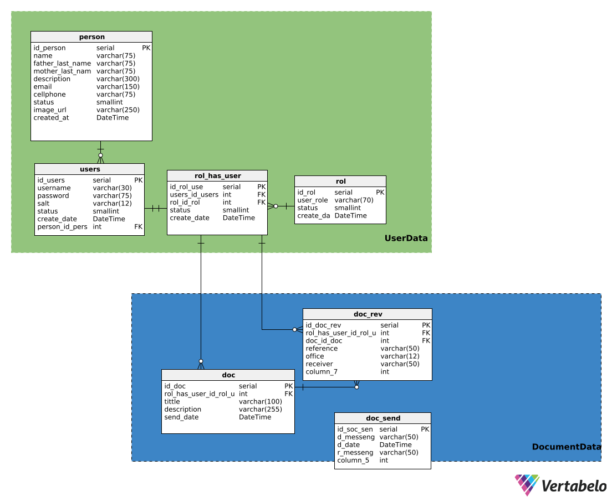

# CorrespondenciaGDyA
## Especificaciones del sistema
Este sistema fue desarrollado con:
Frontend: NextJs utilizando node v18.18.0
Backend: Spring-boot java
BD: Postgresql

## Funciones del sistema
1. Inicio de sesión con manejo de JWT
2. Manejo de token refresh (7 días)
3. Registro de nuevos usuarios, con envio de correo electrónico
4. Subida de documentos
5. Registro de documentos enviados
6. Monitoreo de documentos
7. Observaciones de documentos
8. Registro de documentos revisados

## Video muestra del sistema


## Base de datos
### Diseño de base de datos
 

### Inicializar BD

1. Construir una imagen en base al documento docker, ubicado en el directorio "docerAndDataBase"

```
docker build -t img-correspondencia ./docker_and_data_base
```

2. Crear un contenedor en base a la imagen

```
docker run -d -p 5434:5432 --name cont-correspondencia img-correspondencia
```

3. Conectarse a la base de datos

```
docker exec -it cont-correspondencia psql -U postgres -d correspondencia
```

4. Ejecución de la RESTful API con spring-boot

```
mvn spring-boot:run
```

La base de datos es creada autimáticamente una vez construida la imagen, así que la aplicación esta
lista para ser utilizada.
